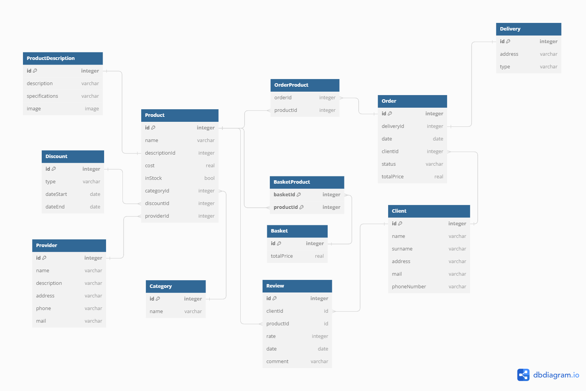

# Функциональные требования

## Авторизация пользователя
Пользователь должен иметь возможность авторизоваться в системе с помощью своих учетных данных.

## Управление пользователями (CRUD)
Администратор системы должен иметь возможность создавать, читать, обновлять и удалять пользовательские учетные записи.

## Система ролей
Система должна поддерживать разные роли пользователей, такие как:
- Неавторизованный пользователь
- Авторизованный пользователь
- Администратор

## Журналирование действий пользователя
Система должна вести журнал действий пользователей, чтобы отслеживать их активность в системе.

## Неавторизованный пользователь
Неавторизованный пользователь должен иметь доступ к следующим функциям:
- Вход в систему
- Регистрация
- Просмотр каталога продуктов
- Просмотр подробной информации о продукте
- Фильтрация продуктов по категориям
- Просмотр отзывов о продуктах

## Авторизованный пользователь
Авторизованный пользователь должен иметь доступ к следующим функциям:
- Добавление продукта в корзину и его удаление
- Создание заказа
- Просмотр истории заказов
- Создание отзыва
- Использование персональных скидок
- Отмена заказа или изменение статуса заказа

## Администратор
Администратор должен иметь доступ к следующим функциям:
- Управление каталогом продуктов
- Редактирование категорий продуктов
- Управление информацией о поставщиках
- Управление заказами
- Управление скидками
- Управление пользователями

# Диаграмма

# Информационная модель

## Клиент
Клиент должен иметь следующие атрибуты:
- Имя
- Фамилия
- Адрес
- Почта
- Номер телефона
- Роль (например, "Клиент")

## Товар
Товар должен иметь следующие атрибуты:
- ID товара (уникальный идентификатор)
- Название товара
- Подробное описание (ссылка на таблицу "Описание товара")
- Цена
- Категория товара
- Наличие товара (количество доступных единиц)
- Скидка (ссылка на таблицу "Скидка")
- Поставщик

## Скидка
Скидка должна иметь следующие атрибуты:
- ID скидки (уникальный идентификатор)
- Тип скидки (процент, фиксированная, купон, бонусные баллы)
- Дата начала
- Дата окончания
- Описание

## Описание товара
Описание товара должно иметь следующие атрибуты:
- ID описания товара (уникальный идентификатор)
- Описание
- Изображение
- Характеристики

## Категория
Категория должна иметь следующие атрибуты:
- ID категории (уникальный идентификатор)
- Название категории

## Корзина
Корзина должна иметь следующие атрибуты:
- ID корзины (уникальный идентификатор)
- Полная стоимость корзины

## Заказ
Заказ должен иметь следующие атрибуты:
- ID заказа (уникальный идентификатор)
- ID клиента (ссылка на таблицу "Клиент")
- ID доставки (ссылка на таблицу "Доставка")
- Дата заказа
- Сумма заказа
- Статус заказа (например, в обработке, отправлен и т.д.)

## Отзыв
Отзыв должен иметь следующие атрибуты:
- ID отзыва (уникальный идентификатор)
- ID клиента (ссылка на таблицу "Клиент")
- Оценка (рейтинг)
- Дата отзыва
- Текст отзыва

## Поставщик
Поставщик должен иметь следующие атрибуты:
- ID поставщика (уникальный идентификатор)
- Название компании
- Адрес
- Телефон
- Электронная почта

## Доставка
Доставка должна иметь следующие атрибуты:
- ID доставки (уникальный идентификатор)
- Адрес
- Тип доставки
